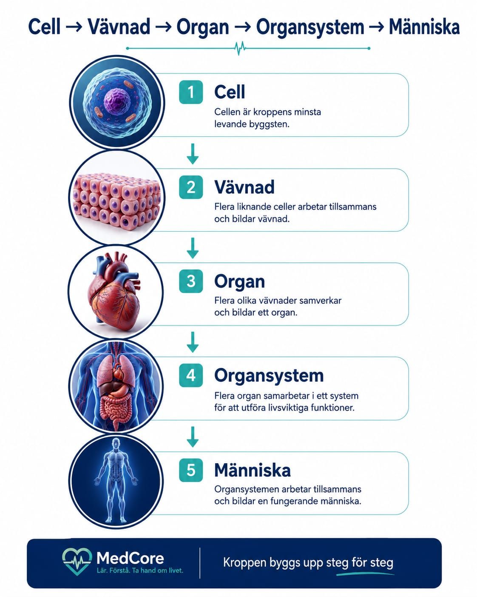

# Anatomi 1

# Cell och vävnad

  

## Introduktion

Cellen är kroppens minsta levande byggsten.

Alla människor består av miljarder celler som arbetar tillsammans för att kroppen ska fungera.

Celler med samma uppgift bildar vävnader och flera vävnader bildar organ.

## Från cell till människa

Kroppen byggs upp steg för steg:

1. Cell
2. Vävnad
3. Organ
4. Organsystem
5. Människa

### Cell

Cellen är den minsta levande enheten i kroppen.

### Vävnad

Flera liknande celler bildar en vävnad.

### Organ

Flera vävnader tillsammans bildar ett organ.

### Organsystem

Flera organ samarbetar i ett organsystem.

### Människa

Alla organsystem arbetar tillsammans för att människan ska leva och fungera.

## Sammanfattning

Cell → Vävnad → Organ → Organsystem → Människa

Detta är kroppens grundläggande organisation.

## Quiz

### Fråga 1

Vad är kroppens minsta levande byggsten?

- Organ
- Cell
- Vävnad

Svar: Cell

### Fråga 2

Vad bildar flera liknande celler?

- Vävnad
- Organ
- Människa

Svar: Vävnad
